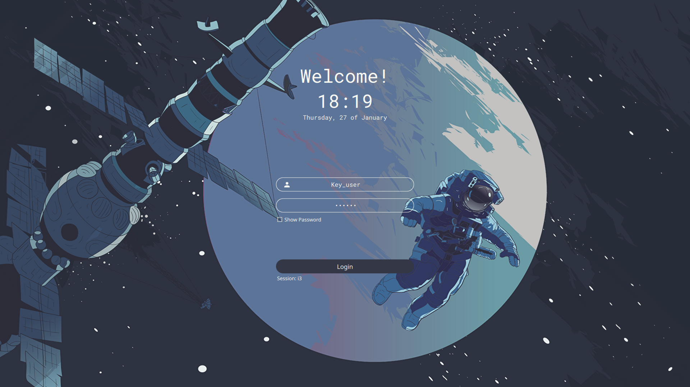

# sddm-astronaut-theme

A theme for the [SDDM login manager](https://github.com/sddm/sddm) based on [`Sugar Dark for SDDM`](https://github.com/MarianArlt/sddm-sugar-dark).
Screen resolution: 1080p.

### Preview


### Install

1. Clone the repository with:

   ```sh
   sudo git clone https://github.com/keyitdev/sddm-astronaut-theme.git /usr/share/sddm/themes/
   ```

2. Then edit `/etc/sddm.conf`, so that it looks like this:

    ```sh
    [Theme]
    Current=sddm-astronaut-theme
    ```
3. Copy fonts.

    ```sh
    sudo cp ./Fonts/* /usr/share/fonts/
    ```

### Credits

Based on the theme [`Sugar Dark for SDDM`](https://github.com/MarianArlt/sddm-sugar-dark) by **MarianArlt**.

### License

Distributed under the [GPLv3+](https://www.gnu.org/licenses/gpl-3.0.html) License.
